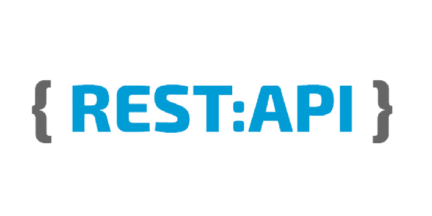
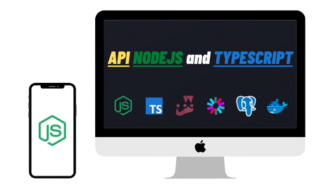

<h1 align="center">
    
</h1>

    
    

  <a href="#rocket-technologies">Technologies</a>&nbsp;&nbsp;&nbsp;|&nbsp;&nbsp;&nbsp;
  <a href="#laptop-project">Project</a>&nbsp;&nbsp;&nbsp;|&nbsp;&nbsp;&nbsp;  
  <a href="#memo-licence">License</a>

 

  

## :rocket: Technologies

This project was developed with the following technologies:

- [Node.js](https://nodejs.org/en/)
- [Typescript](https://www.typescriptlang.org/)
- [Jest](https://jestjs.io/)
- [JWT](https://jwt.io/)
- [Postgresql](https://www.postgresql.org/)
- [Docker](https://www.docker.com/)

## :laptop: Project

Under construction.

## :memo: License

This project is under the MIT license. See file [LICENSE](LICENSE.md) for more details.

---

Made with ? by Ricelli Carvalho :wave: